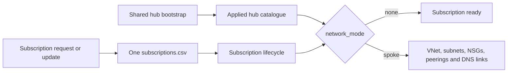

# Subscription networking lifecycle

The hub is shared platform infrastructure. A project becomes a spoke when its subscription request or update opts into networking. The source of truth is the existing subscription CSV.

## Operational flow

1. Create or onboard a connectivity subscription with the Manager and keep its `network_mode=none`.
2. Run the shared hub bootstrap once. It creates a hub VNet, protected subnets and selected central private DNS zones.
3. Configure the resulting hub alias in the subscription pipeline and portal.
4. Request a workload subscription and choose **No managed network** or **Create spoke and connect to shared hub**.
5. Review and merge the portal's Azure DevOps PR. The subscription pipeline creates the subscription first and then its optional spoke.
6. An existing project can join later through **Update subscription**, selecting a spoke and unused address ranges.

Each project/environment gets its own VNet when `network_mode=spoke`. It does not share another project's subnet. Peering connects the hub and spoke; it does not create transitive spoke-to-spoke routing.

## State and ownership

| Resources | State owner | Pipeline |
| --- | --- | --- |
| Shared hub, hub subnets and central DNS zones | Separate hub backend | `azure-pipelines-network-hub.yaml` |
| Subscription bootstrap, optional spoke, both peerings and spoke DNS links | Existing subscription lifecycle backend | `azure-pipelines.yaml` |
| Application resources and private endpoint zone groups | Application stack | Your workload pipeline |

Hub-side peerings and spoke DNS links belong to the subscription lifecycle. The hub stack does not enumerate or remove them. Removing a project must not remove the hub or central DNS zones.

Workload stacks consume `subscription_networks["project-environment"]`, including `subscription_id`, `virtual_network_id` and `subnet_ids`. Publish only that output as a restricted deployment contract rather than sharing the complete subscription state.

The Manager owns the spoke resource group, VNet, subnets and NSGs. Application stacks deploy into the exported subnet IDs; they must not redeclare or modify those resources. Remove application resources before approving spoke teardown.

## Configure the shared hub

Create an Azure Pipelines definition from `azure-pipelines-network-hub.yaml` in the operational Azure DevOps repository.

1. Configure the workload identity federation service connection `spi-azure-landing-zone-network-hub`, or change the pipeline parameter.
2. Supply secure files `networking-hub-platform-prod.azurerm.tfbackend` and `networking-hub-platform-prod.tfvars`. Use examples under `infrastructure/networking/hub/` and a separate backend key/container for the hub.
3. In the input file, set the existing connectivity `subscription_id`, hub prefixes, selected private DNS zones, mandatory tags and production delete lock.
4. Configure approvals and an exclusive lock check on environment `networking-platform-prod`.
5. Run from `main` with `hubKey=platform`, `environmentName=prod` and `enableApply=true`. Review the saved plan before its environment approval.

The provider explicitly registers Microsoft.Network in the connectivity subscription. After successful apply, the pipeline publishes a restricted `network-hub-catalog` artifact and tags the run `HubCatalog`. Its `network-hubs.auto.tfvars.json` contains the `network_hubs.platform` contract without credentials. The plan-only default does not publish an applied hub catalogue.

## Connect the subscription pipeline and portal

Set the default `hubPipelineId` in `azure-pipelines.yaml` to the numeric Azure Pipelines definition ID of the hub bootstrap. Subscription plans then download the latest successful applied catalogue from `main`, tagged `HubCatalog`, into their own saved plan. Authorize the lifecycle pipeline to read that pipeline's artifacts.

With `hubPipelineId="0"`, the default, no artifact is downloaded. Supply `network_hubs` in the existing secure file `landing-zone-prod.tfvars` instead. This also supports multiple hubs. Do not configure the same hub through both input paths.

Configure `PORTAL_NETWORK_HUBS=platform` in the portal environment, or `network_hub_aliases=["platform"]` in the Container Apps Terraform stack. The alias must exactly match a key in `network_hubs`. Empty portal configuration disables the spoke choice.

Use `network_external_address_spaces` to reserve prefixes of existing manually managed spokes, VPN-connected networks and on-premises ranges. Terraform checks them together with the hub and managed spokes before subscription creation. Existing VNets are not automatically discovered or imported. The hub bootstrap also reads the same CSV to reject overlap with active spokes assigned to its alias; include other connected ranges through its external_address_spaces input.

The lifecycle service connection needs networking permissions in every workload subscription, provider registration rights, peering permissions on the hub, and private DNS link permissions on its central zones. Use appropriate inherited roles and verify propagation for newly attached subscriptions.

Keep the operational CSV and portal PRs in the same Azure DevOps repository consumed by these pipelines. GitHub hosts the published starter source. A source mirror alone does not synchronize CSV changes between repositories.

## Subscription CSV contract

Identity, billing, tags and access group fields stay unchanged. Networking fields are configuration controls, excluded from subscription tags.

| Field | `none` | `spoke` |
| --- | --- | --- |
| `network_mode` | Default for missing/empty legacy fields | `spoke` |
| `network_hub_key` | Empty | Configured alias, e.g. `platform` |
| `network_address_space` | Empty | Canonical IPv4 CIDR, e.g. `10.20.0.0/16` |
| `network_workload_subnet_prefix` | Empty | CIDR inside the VNet, e.g. `10.20.1.0/24` |
| `network_private_endpoint_subnet_prefix` | Empty | Separate CIDR, e.g. `10.20.2.0/24` |

Use unique ranges per project/environment. For multiple environments, create separate request cards with distinct CIDRs; duplicated ranges are rejected.

New subscriptions can leave `subscription_id` empty: Terraform passes the subscription module's output directly to networking. Enabling a spoke later on the same project/environment uses the existing subscription state. For externally created subscriptions, first follow the [onboarding guide](../infrastructure/existing-subscriptions.md) and supply the actual subscription ID.

Renaming project/environment keys is a state migration. Review the resulting plan deliberately.

## Network behavior and boundaries

- Spokes get workload and private endpoint subnets with NSGs and private endpoint network policies enabled.
- Implicit outbound internet access is disabled. Configure deliberate egress such as NAT or a firewall for workloads needing internet access.
- Peering enables VNet access in both directions. Forwarded traffic, gateway transit and remote gateway use are disabled by default.
- Central private DNS zones link to every selected spoke without automatic VM registration. Application private endpoints create their DNS zone groups/records against those zones.
- Firewall, NAT, VPN/ExpressRoute gateways, DNS resolvers and custom routes are separate extensions.

Subnet and peering properties follow the [Azure VNet API](https://learn.microsoft.com/en-us/azure/templates/microsoft.network/2024-05-01/virtualnetworks) and [peering API](https://learn.microsoft.com/en-us/azure/templates/microsoft.network/2024-05-01/virtualnetworks/virtualnetworkpeerings).

## Approvals, removals and validation

Plans and applies use `-parallelism=1` to serialize peering operations. Apply uses that run's saved plan, verifies its commit is current on `main`, and runs through the configured environment approval. Configure exclusive lock checks on deployment environments and avoid concurrent hub changes while provisioning spokes.

The plan guard rejects network deletion, replacement and address changes before publishing the apply artifact. This includes switching a managed spoke to `none`, destroying its subscription, and deleting hub/DNS resources.

For intentional removal, remove dependent workloads first, review the CSV/configuration change, then queue a manual run with `allowNetworkDeletion=true`. Keep environment approvals and locks enabled. A production hub delete lock adds protection.

Network registration waits once for `network_provider_registration_wait`, default `90s`. Increase it if tenant propagation takes longer. Mocked tests do not prove tenant permissions or Azure propagation times.

`azure-pipelines-validation.yaml` runs Node tests, plan-guard tests, Terraform validation and mocked tests for integration, hub, spokes and address ranges. For Azure Repos, configure a build validation branch policy; YAML `pr` triggers alone do not enforce Azure Repos PR validation.

No live Azure deployment is needed for these checks. Deployment requires working billing and Entra permissions, service connections, secure files, backend access and approved environments.
